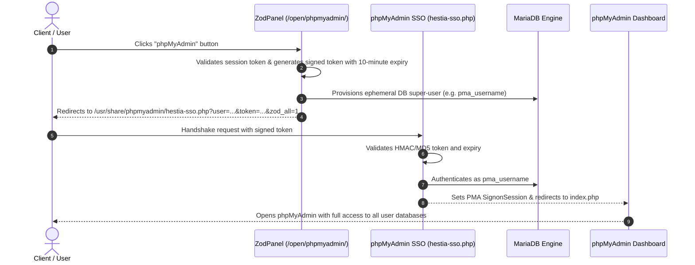
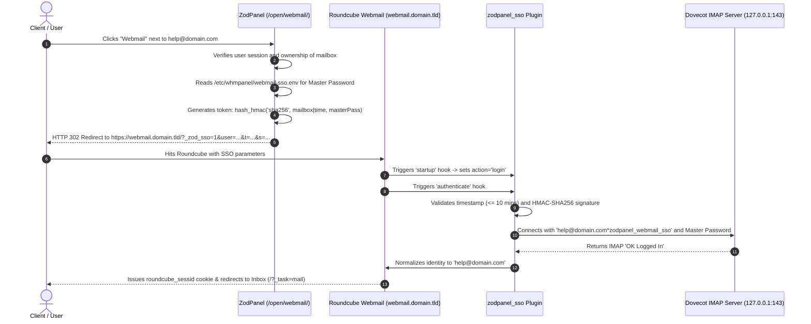

# Single Sign-On (SSO) Architecture & Implementation Guide

This guide provides an in-depth breakdown of the Single Sign-On (SSO) systems implemented in **ZodPanel**:
1. **phpMyAdmin Multi-Database SSO** (`hestia-sso.php`)
2. **Roundcube Webmail SSO** via Dovecot Master User authentication (`zodpanel_sso`)

---

## 1. phpMyAdmin Single Sign-On Architecture

### Overview
In standard installations, accessing phpMyAdmin requires entering individual database usernames and passwords. ZodPanel implements **All-Database User SSO** and **Single-Database Token SSO**, allowing authenticated panel users to log directly into phpMyAdmin without re-entering database passwords.

### Flow Diagram


### Key Components
- **ZodPanel Handler**: `/usr/local/hestia/web/open/phpmyadmin/index.php`
- **SSO Receiver**: `/usr/share/phpmyadmin/hestia-sso.php`
- **Nginx Route**: `/etc/nginx/conf.d/phpmyadmin.inc`
  ```nginx
  location /phpmyadmin/hestia-sso.php {
      alias /usr/share/phpmyadmin/hestia-sso.php;
      fastcgi_pass 127.0.0.1:9000;
      fastcgi_index index.php;
      include fastcgi_params;
      fastcgi_param SCRIPT_FILENAME $request_filename;
  }
  ```

---

## 2. Roundcube Webmail SSO via Dovecot Master User

### Overview
Traditional webmail requires users to memorize separate passwords for each mailbox. ZodPanel implements **HMAC-SHA256 Signed Master Authentication** that bridges Roundcube directly to Dovecot's Master User mechanism (`mailbox@domain.tld*masteruser`).

### Flow Diagram


### Configuration Files
1. **Master User Credentials**: `/etc/whmpanel/webmail-sso.env` (chmod 644)
   ```ini
   WEBMAIL_SSO_MASTER_USER='zodpanel_webmail_sso'
   WEBMAIL_SSO_MASTER_PASS='<STRONG_RANDOM_SECRET>'
   ```
2. **Dovecot Master User Config**: `/etc/dovecot/conf.d/10-auth.conf`
   ```conf
   auth_master_user_separator = *
   !include auth-master.conf.ext
   ```
3. **Dovecot Password Store**: `/etc/dovecot/master-users` (chmod 600)
   ```conf
   zodpanel_webmail_sso:{SHA512-CRYPT}<CRYPT_HASH>
   ```
4. **Roundcube SSO Plugin**: `/var/lib/roundcube/plugins/zodpanel_sso/zodpanel_sso.php`
   - Active in `/etc/roundcube/config.inc.php`:
     ```php
     $config['plugins'] = ['zodpanel_sso', 'password', 'newmail_notifier', 'zipdownload', 'archive'];
     ```
